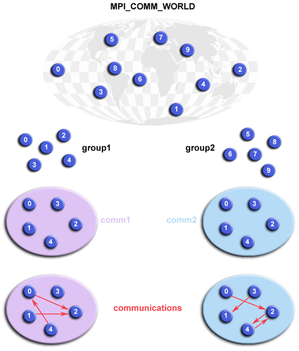

### Groups vs. Communicators:

A group is an ordered set of processes. Each process in a group is associated with a unique integer rank. Rank values start at zero and go to N-1, where N is the number of processes in the group. In MPI, a group is represented within system memory as an object. It is accessible to the programmer only by a "handle". A group is always associated with a communicator object.

A communicator encompasses a group of processes that may communicate with each other. All MPI messages must specify a communicator. In the simplest sense, the communicator is an extra "tag" that must be included with MPI calls. Like groups, communicators are represented within system memory as objects and are accessible to the programmer only by "handles". For example, the handle for the communicator that comprises all tasks is MPI_COMM_WORLD.

From the programmer's perspective, a group and a communicator are one. The group routines are primarily used to specify which processes should be used to construct a communicator.

### Primary Purposes of Group and Communicator Objects:

1. Allow you to organize tasks, based upon function, into task groups.
1. Enable Collective Communications operations across a subset of related tasks.
1. Provide basis for implementing user defined virtual topologies.
1. Provide for safe communications.

### Programming Considerations and Restrictions:

Groups/communicators are dynamic - they can be created and destroyed during program execution.

Processes may be in more than one group/communicator. They will have a unique rank within each group/communicator.

MPI provides over 40 routines related to groups, communicators, and virtual topologies.

**Typical usage:**
1. Extract handle of global group from MPI_COMM_WORLD using MPI_Comm_group
1. Form new group as a subset of global group using MPI_Group_incl
1. Create new communicator for new group using MPI_Comm_create
1. Determine new rank in new communicator using MPI_Comm_rank
1. Conduct communications using any MPI message passing routine
1. When finished, free up new communicator and group (optional) using MPI_Comm_free and MPI_Group_free




### Examples

Create two different process groups for separate collective communications exchange. Requires creating new communicators also.

#### C Language - Group and Communicator Example

```
#include "mpi.h"
#include <stdio.h>
#define NPROCS 8

main(int argc, char *argv[])  {
int        rank, new_rank, sendbuf, recvbuf, numtasks,
            ranks1[4]={0,1,2,3}, ranks2[4]={4,5,6,7};
MPI_Group  orig_group, new_group;   // required variables
MPI_Comm   new_comm;   // required variable

MPI_Init(&argc,&argv);
MPI_Comm_rank(MPI_COMM_WORLD, &rank);
MPI_Comm_size(MPI_COMM_WORLD, &numtasks);

if (numtasks != NPROCS) {
    printf("Must specify MP_PROCS= %d. Terminating.\n",NPROCS);
    MPI_Finalize();
    exit(0);
    }

sendbuf = rank;

// extract the original group handle
MPI_Comm_group(MPI_COMM_WORLD, &orig_group);

//  divide tasks into two distinct groups based upon rank
if (rank < NPROCS/2) {
    MPI_Group_incl(orig_group, NPROCS/2, ranks1, &new_group);
    }
else {
    MPI_Group_incl(orig_group, NPROCS/2, ranks2, &new_group);
    }

// create new new communicator and then perform collective communications
MPI_Comm_create(MPI_COMM_WORLD, new_group, &new_comm);
MPI_Allreduce(&sendbuf, &recvbuf, 1, MPI_INT, MPI_SUM, new_comm);

// get rank in new group
MPI_Group_rank (new_group, &new_rank);
printf("rank= %d newrank= %d recvbuf= %d\n",rank,new_rank,recvbuf);

MPI_Finalize();
}
```

#### Fortran - Group and Communicator Example

```
program group
include 'mpif.h'

integer NPROCS
parameter(NPROCS=8)
integer rank, new_rank, sendbuf, recvbuf, numtasks
integer ranks1(4), ranks2(4), ierr
integer orig_group, new_group, new_comm   ! required variables
data ranks1 /0, 1, 2, 3/, ranks2 /4, 5, 6, 7/

call MPI_INIT(ierr)
call MPI_COMM_RANK(MPI_COMM_WORLD, rank, ierr)
call MPI_COMM_SIZE(MPI_COMM_WORLD, numtasks, ierr)

if (numtasks .ne. NPROCS) then
    print *, 'Must specify NPROCS= ',NPROCS,' Terminating.'
    call MPI_FINALIZE(ierr)
    stop
endif

sendbuf = rank

! extract the original group handle
call MPI_COMM_GROUP(MPI_COMM_WORLD, orig_group, ierr)

! divide tasks into two distinct groups based upon rank
if (rank .lt. NPROCS/2) then
    call MPI_GROUP_INCL(orig_group, NPROCS/2, ranks1, new_group, ierr)
else
    call MPI_GROUP_INCL(orig_group, NPROCS/2, ranks2, new_group, ierr)
endif

! create new new communicator and then perform collective communications
call MPI_COMM_CREATE(MPI_COMM_WORLD, new_group, new_comm, ierr)
call MPI_ALLREDUCE(sendbuf, recvbuf, 1, MPI_INTEGER, MPI_SUM, new_comm, ierr)

! get rank in new group
call MPI_GROUP_RANK(new_group, new_rank, ierr)
print *, 'rank= ',rank,' newrank= ',new_rank,' recvbuf= ', recvbuf

call MPI_FINALIZE(ierr)
end
```

Sample program output:

```
rank= 7 newrank= 3 recvbuf= 22
rank= 0 newrank= 0 recvbuf= 6
rank= 1 newrank= 1 recvbuf= 6
rank= 2 newrank= 2 recvbuf= 6
rank= 6 newrank= 2 recvbuf= 22
rank= 3 newrank= 3 recvbuf= 6
rank= 4 newrank= 0 recvbuf= 22
rank= 5 newrank= 1 recvbuf= 22
```
