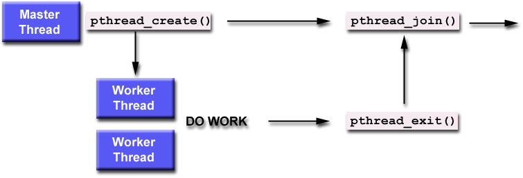

### Routines:
[pthread_join](man/pthread_join.txt) (threadid,status)

[pthread_detach](man/pthread_detach.txt) (threadid)

[pthread_attr_setdetachstate](man/pthread_attr_setdetachstate.txt) (attr,detachstate)

[pthread_attr_getdetachstate](man/pthread_attr_getdetachstate.txt) (attr,detachstate)

### Joining:

"Joining" is one way to accomplish synchronization between threads. For example:

The `pthread_join()` subroutine blocks the calling thread until the specified threadid thread terminates.

The programmer is able to obtain the target thread's termination return `status` if it was specified in the target thread's call to `pthread_exit()`.

A joining thread can match one `pthread_join()` call. It is a logical error to attempt multiple joins on the same thread.

Two other synchronization methods, mutexes and condition variables, will be discussed later.

### Joinable or Not?

When a thread is created, one of its attributes defines whether it is joinable or detached. Only threads that are created as joinable can be joined. If a thread is created as detached, it can never be joined.

The final draft of the POSIX standard specifies that threads should be created as joinable.

To explicitly create a thread as joinable or detached, the `attr` argument in the `pthread_create()` routine is used. The typical 4 step process is:

* Declare a pthread attribute variable of the `pthread_attr_t` data type
* Initialize the attribute variable with `pthread_attr_init()`
* Set the attribute detached status with `pthread_attr_setdetachstate()`
* When done, free library resources used by the attribute with `pthread_attr_destroy()`

### Detaching 

The `pthread_detach()` routine can be used to explicitly detach a thread even though it was created as joinable.

There is no converse routine.

### Recommendations:

If a thread requires joining, consider explicitly creating it as joinable. This provides portability as not all implementations may create threads as joinable by default.

If you know in advance that a thread will never need to join with another thread, consider creating it in a detached state. Some system resources may be able to be freed.
