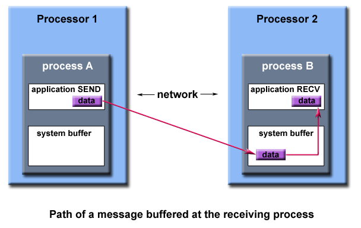
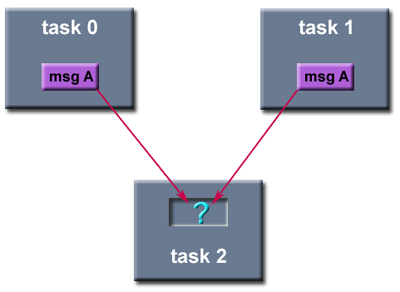

### First, a Simple Example:

The value of PI can be calculated in various ways. Consider the Monte Carlo method of approximating PI:

* Inscribe a circle with radius r in a square with side length of 2r
* The area of the circle is <MATH>Πr^2</MATH> and the area of the square is <MATH>4r^2</MATH>
* The ratio of the area of the circle to the area of the square is: 
<MATH>Πr^2 / 4r^2 = Π / 4</MATH>
* If you randomly generate $N$ points inside the square, approximately 
$N * Π / 4$ of those points ($M$) should fall inside the circle.
* Π is then approximated as: 
$N * Π / 4 = M$
$Π / 4 = M / N$
$Π = 4 * M / N$

Note that increasing the number of points generated improves the approximation.


Serial pseudo code for this procedure

```

npoints = 10000
circle_count = 0

do j = 1,npoints
  generate 2 random numbers between 0 and 1
  xcoordinate = random1
  ycoordinate = random2
  if (xcoordinate, ycoordinate) inside circle
  then circle_count = circle_count + 1
end do

PI = 4.0*circle_count/npoints
```

leads to an "embarrassingly parallel" solution:
* It breaks the loop iterations into chunks that can be executed by different tasks simultaneously.
* Each task executes its portion of the loop a number of times.
* Each task can do its work without requiring any information from the other tasks (there are no data dependencies).
* Master task receives results from other tasks **using send/receive point-to-point operations**.

Pseudo code solution: **bold** highlights changes for parallelism.
<pre>
npoints = 10000
circle_count = 0

<b>p = number of tasks</b>
<b>num = npoints/p</b>

<b>find out if I am MASTER or WORKER</b>

do j = 1,<b>num</b> 
  generate 2 random numbers between 0 and 1
  xcoordinate = random1
  ycoordinate = random2
  if (xcoordinate, ycoordinate) inside circle
  then circle_count = circle_count + 1
end do

<b>
if I am MASTER
  receive from WORKERS their circle_counts
  compute PI (use MASTER and WORKER calculations)
else if I am WORKER
  send to MASTER circle_count
endif
</b>
</pre>

***Key Concept**: Divide work between available tasks which communicate data via point-to-point message passing calls.*


### Types of Point-to-Point Operations:

MPI point-to-point operations typically involve message passing between two, and only two, different MPI tasks. One task is performing a send operation and the other task is performing a matching receive operation.

There are different types of send and receive routines used for different purposes. For example:
* Synchronous send
* Blocking send / blocking receive
* Non-blocking send / non-blocking receive
* Buffered send
* Combined send/receive
* "Ready" send

Any type of send routine can be paired with any type of receive routine.

MPI also provides several routines associated with send - receive operations, such as those used to wait for a message's arrival or probe to find out if a message has arrived.

### Buffering

In a perfect world, every send operation would be perfectly synchronized with its matching receive. This is rarely the case. Somehow or other, the MPI implementation must be able to deal with storing data when the two tasks are out of sync.

Consider the following two cases:
* A send operation occurs 5 seconds before the receive is ready - where is the message while the receive is pending?
* Multiple sends arrive at the same receiving task which can only accept one send at a time - what happens to the messages that are "backing up"?

The MPI implementation (not the MPI standard) decides what happens to data in these types of cases. Typically, a **system buffer** area is reserved to hold data in transit. For example:



System buffer space is:
* Opaque to the programmer and managed entirely by the MPI library
* A finite resource that can be easy to exhaust
* Often mysterious and not well documented
* Able to exist on the sending side, the receiving side, or both
* Something that may improve program performance because it allows send - receive operations to be asynchronous.

User managed address space (i.e. your program variables) is called the **application buffer**. MPI also provides for a user managed send buffer.

### Blocking vs. Non-blocking

Most of the MPI point-to-point routines can be used in either blocking or non-blocking mode.

#### Blocking:

A blocking send routine will only "return" after it is safe to modify the application buffer (your send data) for reuse. Safe means that modifications will not affect the data intended for the receive task. Safe does not imply that the data was actually received - it may very well be sitting in a system buffer.

A blocking send can be synchronous which means there is handshaking occurring with the receive task to confirm a safe send.

A blocking send can be asynchronous if a system buffer is used to hold the data for eventual delivery to the receive.

A blocking receive only "returns" after the data has arrived and is ready for use by the program.

#### Non-blocking:

Non-blocking send and receive routines behave similarly - they will return almost immediately. They do not wait for any communication events to complete, such as message copying from user memory to system buffer space or the actual arrival of message.

Non-blocking operations simply "request" the MPI library to perform the operation when it is able. The user can not predict when that will happen.

It is unsafe to modify the application buffer (your variable space) until you know for a fact the requested non-blocking operation was actually performed by the library. There are "wait" routines used to do this.

Non-blocking communications are primarily used to overlap computation with communication and exploit possible performance gains.

<table>
<tr>
<th>Blocking Send</th>
<th>Non-blocking Send</th>
</tr>
<tr>
<td>
<pre>
myvar = 0;

for (i=1; i<ntasks; i++) {
   task = i;
   <b>MPI_Send (&myvar ... ... task ...);</b>
   myvar = myvar + 2

   /* do some work */

   }
</pre>
</td>
<td>
<pre>
myvar = 0;

for (i=1; i<ntasks; i++) {
   task = i;
   <b>MPI_Isend (&myvar ... ... task ...);</b>
   myvar = myvar + 2;

   /* do some work */

   <b>MPI_Wait (...);</b>
   }
</pre>
</td>
</tr>
<tr>
<td style="text-align:center">
<b>Safe. Why?</b>
</td>
<td style="text-align:center">
<b>Unsafe. Why?</b>
</td>
</tr>
</table>

### Order and Fairness:

#### Order:

MPI guarantees that messages will not overtake each other.

If a sender sends two messages (Message 1 and Message 2) in succession to the same destination, and both match the same receive, the receive operation will receive Message 1 before Message 2.

If a receiver posts two receives (Receive 1 and Receive 2), in succession, and both are looking for the same message, Receive 1 will receive the message before Receive 2.

Order rules do not apply if there are multiple threads participating in the communication operations.

#### Fairness:

MPI does not guarantee fairness - it's up to the programmer to prevent "operation starvation".

Example: task 0 sends a message to task 2. However, task 1 sends a competing message that matches task 2's receive. Only one of the sends will complete.


