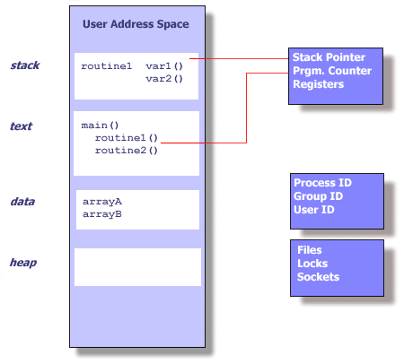

Technically, a thread is defined as an independent stream of instructions that can be scheduled to run as such by the operating system. But what does this mean?

To the software developer, the concept of a "procedure" that runs independently from its main program may best describe a thread.

To go one step further, imagine a main program (`a.out`) that contains a number of procedures. Then imagine all of these procedures being able to be scheduled to run simultaneously and/or independently by the operating system. That would describe a "multi-threaded" program.

How is this accomplished?

Before understanding a thread, one first needs to understand a UNIX process. A process is created by the operating system, and requires a fair amount of "overhead". Processes contain information about program resources and program execution state, including:

* Process ID, process group ID, user ID, and group ID
* Environment
* Working directory
* Program instructions
* Registers
* Stack
* Heap
* File descriptors
* Signal actions
* Shared libraries
* Inter-process communication tools (such as message queues, pipes, semaphores, or shared memory).

 
**Unix process**

**Threads within a unix process**

Threads use and exist within these process resources, yet are able to be scheduled by the operating system and run as independent entities largely because they duplicate only the bare essential resources that enable them to exist as executable code.

This independent flow of control is accomplished because a thread maintains its own:
* Stack pointer
* Registers
* Scheduling properties (such as policy or priority)
* Set of pending and blocked signals
* Thread specific data.

So, in summary, in the UNIX environment a thread:
* Exists within a process and uses the process resources
* Has its own independent flow of control as long as its parent process exists and the OS supports it
* Duplicates only the essential resources it needs to be independently schedulable
* May share the process resources with other threads that act equally independently (and dependently)
* Dies if the parent process dies - or something similar
* Is "lightweight" because most of the overhead has already been accomplished through the creation of its process.

Because threads within the same process share resources:
* Changes made by one thread to shared system resources (such as closing a file) will be seen by all other threads.
* Two pointers having the same value point to the same data.
* Reading and writing to the same memory locations is possible, and therefore requires explicit synchronization by the programmer.
